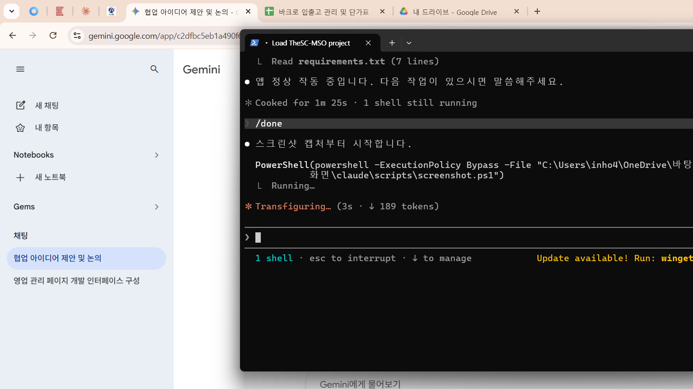

# 작업 기록 — 2026-05-14 18:28

## 작업 요약
- `cosmetics.py` → `app.py` 파일명 변경 (Streamlit Cloud 메인 파일로 지정)
- `app.py` (기존 업무관리 대시보드) → `app_business.py` 파일명 변경
- SQLite → Supabase PostgreSQL 마이그레이션: `PGConn` 래퍼 클래스 구현, `get_conn()` / `run_sql()` / `execute()` 업데이트
- 기존 로컬 데이터(products 15건, clients 17건, stock_in 32건, stock_out 83건) Supabase로 전량 이전
- PostgreSQL 호환 수정: `ROUND(x)` → `ROUND(x::NUMERIC, n)` 캐스팅 (6개소)
- PostgreSQL `GROUP BY` 오류 수정: `page_master()` 쿼리에 비집계 컬럼 전체 명시
- Streamlit Cloud 배포 완료 및 정상 작동 확인
- 모바일 반응형 CSS 추가 (`st.markdown` CSS 블록)
- `requirements.txt`에 `psycopg2-binary` 추가
- `.streamlit/secrets.toml` 생성 (Supabase 접속 URL 저장, gitignore 처리)

## 생성 / 수정된 파일
- `2.TheSC-MSO 사이트/app.py` (구 cosmetics.py — 화장품 유통 관리 앱, 메인 배포 파일)
- `2.TheSC-MSO 사이트/app_business.py` (구 app.py — 업무관리 대시보드)
- `2.TheSC-MSO 사이트/requirements.txt`
- `2.TheSC-MSO 사이트/.gitignore`
- `2.TheSC-MSO 사이트/.streamlit/secrets.toml` (gitignore, 미업로드)

## 스크린샷

## 배포 정보
- **클라우드 URL**: https://claude-workspace-thesc-mso.streamlit.app
- **GitHub**: https://github.com/intheho413/claude-workspace (branch: main)
- **DB**: Supabase PostgreSQL (aws-1-ap-southeast-1, NANO tier)
