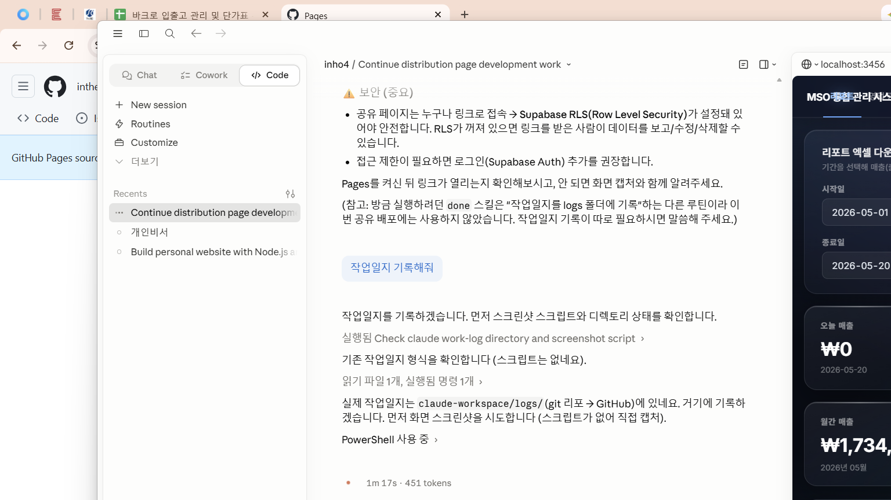

# 작업 기록 — 2026-05-20 20:35

## 작업 요약
- **레이아웃 전환**: 사이드바 → 상단 네비바, 콘텐츠 중앙 정렬(max-width 1080), 페이지 타이틀/배너 제거
- **설정 드로어 추가**: 다크/라이트 모드, 앱 이름·카테고리·메뉴명 편집(localStorage 저장)
- **글래스모피즘 디자인 적용**: 4종 레퍼런스 중 채택 — 반투명 글래스 카드, 그라데이션 막대+발광 스플라인 차트, 라이트모드 대응
- **이모티콘 전부 제거**, 테마/설정은 SVG 아이콘으로 교체
- **앱 이름 변경**: "MSO 통합 관리 시스템", 파비콘(favicon.png) 적용
- **리포트 엑셀 다운로드**: 첨부 양식과 동일한 5개 시트(입고/출고/거래처별/월별/재고), ₩·쉼표 숫자서식 + 헤더색상·교차행·테두리 스타일(xlsx-js-style)
- **계약서 발급**: .docx 양식 업로드(localStorage) → 플레이스홀더 치환 생성(docxtemplater) + 미리보기(docx-preview), 문단 테두리 오렌더 보정
- **Lot No. 기능**: 입고 시 Lot 자동생성(YYYYMMDD-제품ID-순번), 출고 복수등록 + FIFO기본/Lot수동선택 + 출고가 직접수정(프로모션), 출고 수정에서 Lot·수량·출고가 인라인 수정 + 재고 자동 보정
- **수금 관리**: 수금 등록 실제 저장 연결, 거래처 원장에서 수금 내역 수정·삭제
- **기초관리 제품군**: 드롭다운+직접입력 겸용(datalist), 전체 드롭다운 화살표 스타일 통일
- **공유 배포**: HTML 앱을 claude-workspace/docs 에 푸시 (GitHub Pages 배포 준비)

## 생성 / 수정된 파일
- `C:\Users\inho4\mockup_charts\html_sim2\index.html` — 전면 개편(레이아웃·디자인·Lot·엑셀·계약서·수금)
- `C:\Users\inho4\mockup_charts\html_sim2\favicon.png` — 파비콘 추가
- `C:\Users\inho4\mockup_charts\html_sim2\.gitignore` / git 초기화
- `C:\Users\inho4\mockup_charts\html_sim2\design_refs.html` — 디자인 레퍼런스(4종)
- `C:\Users\inho4\mockup_charts\html_sim2\preview_topnav.html` — 상단네비 미리보기
- `C:\Users\inho4\mockup_charts\claude-workspace\docs\index.html` + `favicon.png` — GitHub Pages 배포본 (push 완료, commit 8070b0c)

## 스크린샷

## 다음 할 일
- GitHub Pages 활성화 (claude-workspace Settings → Pages → main /docs) → `https://intheho413.github.io/claude-workspace/`
- Supabase RLS 설정 (공유 페이지 보안)
- 선택: `stock_out.lot_number` 전용 컬럼 전환, 제품/거래처 등록 실제 저장 연결
- 향후 html_sim2 수정 시 docs/로 복사 재배포(공유 갱신)
